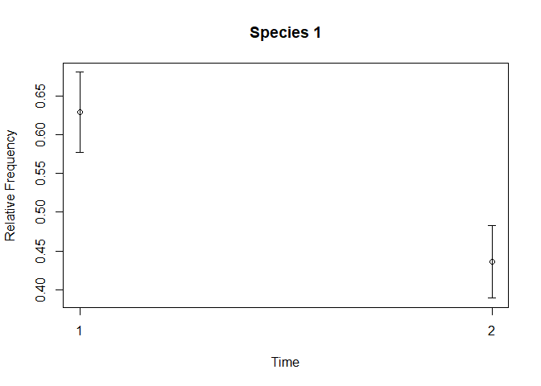
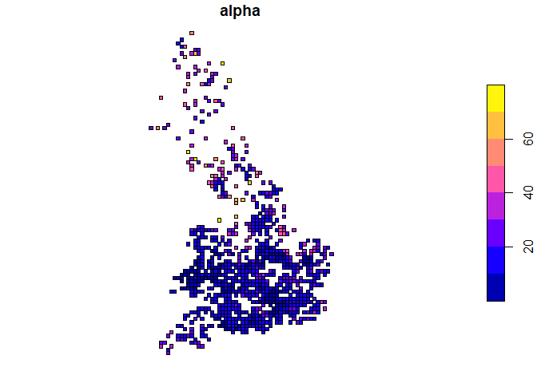
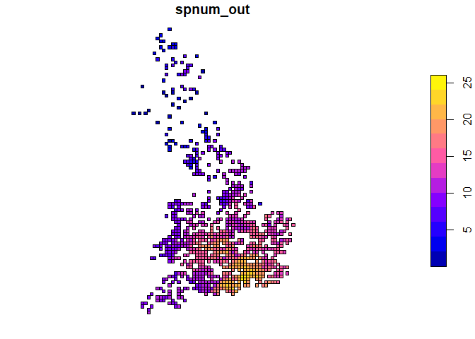

frescalo
================
Colin Harrower, Jonathan Yearsley and Oliver Pescott
2026-03-05

The frescalo package contains an R implementation of Frescalo (FREquency
SCAling LOcal) modeling methodology invented by Dr Mark O. Hill [(Hill,
2011)](https://doi.org/10.1111/j.2041-210X.2011.00146.x) to aid with
analysis of biological record data. The methodology attempts to correct
for spatial and temporal variation in recorder effort that is common in
biological recording data (i.e. species occurrence data).

## Installation

You can install the development version of frescalo from
[GitHub](https://github.com/colinharrower/frescalo) with:

``` r
# install.packages("pak")
pak::pak("colinharrower/frescalo")
```

## Introduction

Frescalo attempts to correct for spatial and temporal variation in
recorder effort by analysing biological records data for a suite of
species, often within a related taxonomic group, and making inference of
the recording effort based on the relative recording frequencies of
these species. Frescalo uses the recording frequency of sets of
**benchmark species**, species believed to be relatively ubiquitous and
stable in occurrence, to determine recording effort. Defining such
**benchmark species** across a wide area would be difficult so instead
frescalo uses sets of **benchmark species** that are unique to localised
**neighbourhoods**. In frescalo a **neighourhood** represent a set of
locations that are biologically or ecologically similar and or located
in relative proximity to each other. In the simplest case neighbourhoods
can be defined purely on proximity, however incorporating biologically
or ecological similarity into the definition and weighting of
neighbourhoods can typically improve the results.

The recording effort for each of these neighbourhoods is determined by
calculating the weighted local species frequencies for each species in
that neighbourhood and then from these species frequencies calculating a
neighborhood frequency. The local species frequencies for that
neighbourhood are then systematically adjusted by a neighbourhood
sampling-effort modifier to inflate or deflate the species frequency
curves until the neightbourhood frequency achieves a specified standard
value (Phi).

## Data required

### Species occurrence data

Frescalo uses biological recording data where the original data has been
summarised to unique combinations of time period, location and species.
The choice of the spatial resolution for the locations and the time
period chosen are up to the user but ideally these should chosen to
allow an adequate level of recording at sites within the time periods.

Frescalo was designed with biological atlas data in mind and as such has
often been applied at typical atlas scales, i.e. 10km<sup>2</sup> square
**sites** and multi-year atlas recording time periods (.e.g. 1980-1995,
2000-2015). Frescalo has however been sucessfully applied at finer
spatial and or temporal resolutions, i.e. 1km<sup>2</sup> or
2km<sup>2</sup> sites and annual time periods.

### Neighbourhood weights

In addition to the species occurrence data Frescalo requires a dataset
specifiying the sites that comprise each individual neighbourhood, and
their relative weightings, for each site. Typically neighbourhoods are
defined by first selecting the `k` closest sites and then from these
selecting the `n` sites showing the greatest similarities to the focal
site. The package includes a function, `calc_neight_wts()` to create a
neighbourhood weights dataset from a `sf spatial polygons` or
`spatial points`object containing attribute fields upon with the
similarities are to be calculated.

## Example

The package contains simulated data which can be used as an example and
or to test the package. The simulated data comrpises two data objects
`s` containing occurrence data and `d` containing neighborhood
weightings. The occurrence data in `s` has already been summarized to
the format required by frescalo, specifically a `data.frame` containing
all unique combinations of time period (`time`), sites or locations
(`location`) and species ids or names (`species`). The neighbourhood
weights data specifies for each focal location (`location1`) which other
sites form its “neighbourhood” (`location2`) and the relevant weighting
score between the focal site and each respective neighbourhood site
(`w`).

``` r
# Load the package
library(frescalo)

# View the first 10 rows of the test dataset s (occurrence data)
head(s,10)
```

    ##    time location    species
    ## 1     1     SO34 Species 11
    ## 2     1     SO37 Species 11
    ## 3     2     SO43 Species 11
    ## 4     1     SO34 Species 11
    ## 5     1     SN96 Species 11
    ## 6     2     SO43 Species 11
    ## 7     2     SN96 Species 11
    ## 8     1     SO05 Species 11
    ## 9     1     SO05 Species 11
    ## 10    2     SN62 Species 11

``` r
# View the first 10 rows of the weights datasets (d)
head(d,10)
```

    ##    location1 location2      w
    ## 1       TV69      SU40 0.0004
    ## 2       TV69      SU41 0.0000
    ## 3       TV69      SU42 0.0000
    ## 4       TV69      SU50 0.0137
    ## 5       TV69      SU60 0.0639
    ## 6       TV69      SU65 0.0005
    ## 7       TV69      SU70 0.0410
    ## 8       TV69      SU76 0.0001
    ## 9       TV69      SU77 0.0006
    ## 10      TV69      SU83 0.0088

In this example dataset the species are identified using simplistic
species IDs and the locations are identified using Ordnance Survey of
Great Britain 10 km grid references, however the site and species
identifiers can be any appropriate names or coded identifiers. The time
periods can be identified as simple coded or numerical identifiers, as
in the example data `d`, or using appropriate numerical values
(e.g. mid-point of the time periods).

The main wrapper function `frescalo()` is used to fit apply the frescalo
model to the data, returning a list comprised of 4`data.frames` `locs`
with the location metrics, `freq` with original and re-scaled species
frequencies, `trend` with tFactors for each species, `site_time` with
the site by time recording effort metrics used for the adjustments. The
outputs are equivalent to the `samples.txt`, `frequencies.out` and
`trend.out` output files produced by Mark Hill’s original fortran
frescalo program.

``` r
# Use test dataset (s) and weights data (d) included with the package
out_fres = frescalo(s,d,in_parallel = FALSE,filter_wts = TRUE)

# Show the names of the elements in out_fres
names(out_fres)
```

    ## [1] "locs"      "freq"      "trend"     "site_time"

The location metrics from frescalo are found in the first `locs` element
of the output list object and is a data.frame structured as follows:

1.  **location** - The location ID/code
2.  **nSpecies** - The number of species recorded
3.  **phi_in** - The original neighbourhood frequency, or
    frequency-weighted mean frequecy, for that locations neighbourhood
4.  **alpha** - The sampling effort modifier required to standardise the
    neighourhood frequency to Phi
5.  **phi_out** - The value of neightbourhood frequecy after rescaling
    (this should match the value of Phi specified as an target)
6.  **spnum_in** - The sum of neighbourhood frequencies before rescaling
7.  **spnum_out** - The sum of neighbourhood frequencies after scaling,
    i.e. the estimated species richness
8.  **iter** - The number of iterations for the algorithm to determine
    the alpha value required for the neightbourhood frequency to reach
    phi

``` r
# Show location outputs from the frescalo results object
head(out_fres[["locs"]])
```

    ##   location nSpecies    phi_in    alpha phi_out spnum_in spnum_out iter
    ## 1     TR36        2 0.1367205 20.08779    0.74 1.952163  16.64654    7
    ## 2     TR34        1 0.1190483 34.61611    0.74 1.100281  13.62739    5
    ## 3     TR26        3 0.1283845 30.75372    0.74 1.282218  13.81837    6
    ## 4     TR16       10 0.1869391 10.88084    0.74 2.980106  15.73302    7
    ## 5     TR15        1 0.1855399 10.81524    0.74 2.970722  15.77083    7
    ## 6     TR14        2 0.1410191 14.16595    0.74 2.017961  13.92664    6

The species frequencies metrics from frescalo are found in the
\`freq\`\` element of the output object and is a data.frame structured
as follows:

1.  **location** - The location ID/code
2.  **species** - The species ID/code/Name
3.  **pres** - Whether the species was recording in that location (0 =
    not recorded, 1 = recorded)
4.  **freq** - The frequency of species in the neighbourhood
5.  **freq_1** - The frequency of the species in the neighbourhood after
    rescaling, i..e the estimated probability of occurrence
6.  **rank** - The rank of that species frequency in the neighbourhood
7.  **rank_1** - The rescaled rank, defined as the rank/estimated
    species richness
8.  **benchmark** - Specifying whether the species was considered a
    benchmark species for the neighbourhood (1 = benchmark species, 0 =
    non-benchmark species)

``` r
# Show the rescaled species frequecy outputs from the frescalo results object
head(out_fres[["freq"]])
```

    ##   location    species pres       freq    freq_1 rank     rank_1 benchmark
    ## 1     TR36  Species 1    1 0.27165159 0.9982833    1 0.06007253         1
    ## 2     TR36 Species 13    1 0.23737656 0.9956761    2 0.12014507         1
    ## 3     TR36  Species 2    0 0.21097121 0.9914331    3 0.18021760         1
    ## 4     TR36 Species 32    0 0.13732783 0.9485621    4 0.24029013         1
    ## 5     TR36  Species 8    0 0.10259340 0.8863268    5 0.30036266         0
    ## 6     TR36  Species 5    0 0.09602601 0.8683959    6 0.36043520         0

The temporal tFactor metrics from frescalo are found in the \`trend\`\`
element of the output object and is a data.frame structured as follows:

1.  **species** - The species ID/code/Name
2.  **time** - The ID/code/value specifying the time period
3.  **tFactor** - The frescalo time factor, i.e. the estimated
    relatively frequency of species at the time
4.  **StDev** - The standard deviation of the time factor

``` r
# Show tFactor trend outputs from the frescalo results object
head(out_fres[["trend"]])
```

    ##      species time   tFactor      StDev    estvar     sptot1
    ## 1  Species 1    1 0.6291580 0.05149657 91.374611 194.634007
    ## 2 Species 10    1 0.2470118 0.04133537 31.131621  42.624572
    ## 3 Species 11    1 0.3490210 0.14781598  5.097999   8.257875
    ## 4 Species 12    1 0.2822276 0.14366985  3.727009   5.940546
    ## 5 Species 13    1 0.5892903 0.04841457 91.667833 189.654332
    ## 6 Species 14    1 0.1471866 0.03420740 17.117783  23.182364

The site by time metrics from frescalo are found in the `site_time`
element of the output object and is a data.frame structured as follows:

1.  **location** - The location ID/code
2.  **time** - The ID/code/value specifying the time period
3.  **s_it** -
4.  **w** -

``` r
# Show the site by time recording effort outputs from the frescalo results object
head(out_fres[["site_time"]])
```

    ##   location time      s_it     w
    ## 1     TR36    1 0.2500000 1.000
    ## 2     TR34    1 0.0000000 0.005
    ## 3     TR26    1 0.6666667 1.000
    ## 4     TR16    1 0.5000000 1.000
    ## 5     TR15    1 0.0000000 0.005
    ## 6     TR14    1 0.0000000 0.005

``` r
# Plot tFactor for a specific species
  plot_tfactor(out_fres[["trend"]][which(out_fres[["trend"]]$species == "Species 1"),])
```

<!-- -->

``` r
library(sf)
```

    ## Linking to GEOS 3.13.1, GDAL 3.11.0, PROJ 9.6.0; sf_use_s2() is TRUE

``` r
# Merge location results from frescalo with spatial polygons for locations in example neighbourhoods (stored in d_locs)
  sf_locs = merge(d_locs, out_fres[["locs"]], by = "location")
# Plot alpha
  fres_map(sf_locs,zcol="alpha")
```

<!-- -->

``` r
# Plot estimated species richness
  fres_map(sf_locs,zcol="spnum_out")
```

<!-- -->
